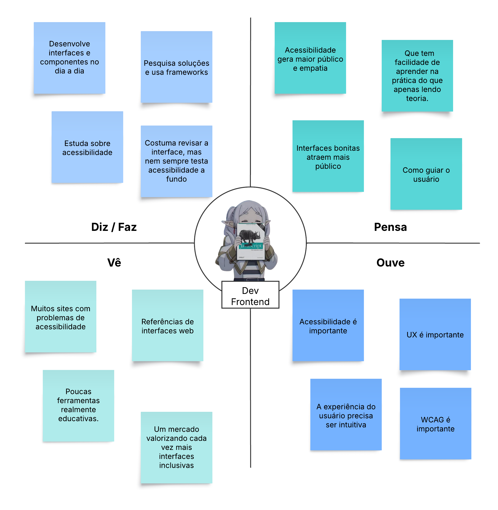
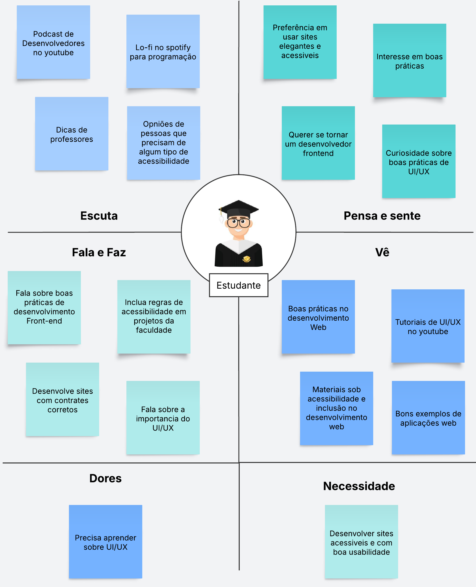

# 2 - Empatizar
*"Esta etapa pressupõe o registro de todas as impressões e informações coletadas sobre as conversas com clientes, pesquisa do seu ambiente e área, bem como as personas envolvidas. 
Isso compreende o domínio, funcionamento da instituição/empresa, dos setores envolvidos, ouvindo e assistindo os  procedimentos e/ou processos da rotina do trabalho do cliente.*

## Personas
### Usuário Dev-Frontend

#### Dores
O desenvolvedor frontend enfrenta dificuldade para aplicar acessibilidade de forma prática no dia a dia, principalmente quando precisa equilibrar qualidade técnica, prazo curto e exigências visuais do projeto. Muitas vezes, ele até reconhece a importância do tema, mas não sabe identificar todos os problemas na interface nem como corrigi-los com segurança e clareza.

 

#### Motivações
Esse desenvolvedor se motiva pela possibilidade de criar interfaces melhores, mais inclusivas e mais profissionais, ao mesmo tempo em que desenvolve suas próprias habilidades. Ele busca aprender de forma prática, com feedback claro e aplicável, para ganhar confiança, evoluir tecnicamente e entregar soluções que realmente funcionem para mais pessoas.

---
### Designer

.jpeg)

### Estudante

### Desenvolvedor Web
.png)

### Pesquisas:

- História de usuário de aplicativo ([OWASP Juice Shop | OWASP Foundation](http://owasp.org/www-project-juice-shop/)) que inspira nosso projeto relatando como teve uma boa experiência aprendendo cybersec a partir dele: [Course Review: OWASP JuiceShop about hands-on hacking an application](https://theporkskewer.medium.com/course-review-owasp-juiceshop-about-hands-on-hacking-an-application-66d7acf1e8e6)

- Site que ensina de forma mais livre e documental a acessibilidade de sites web. [Introduction to Web Accessibility](https://www.w3.org/WAI/fundamentals/accessibility-intro/)

- Material de aprendizado sobre fundamentos de acessibilidade em UI/UX, usar definição de práticas para inspiração (não é para fazer o curso) https://www.thestarter.io/uxdesign/acessibilidade-para-ux-design
