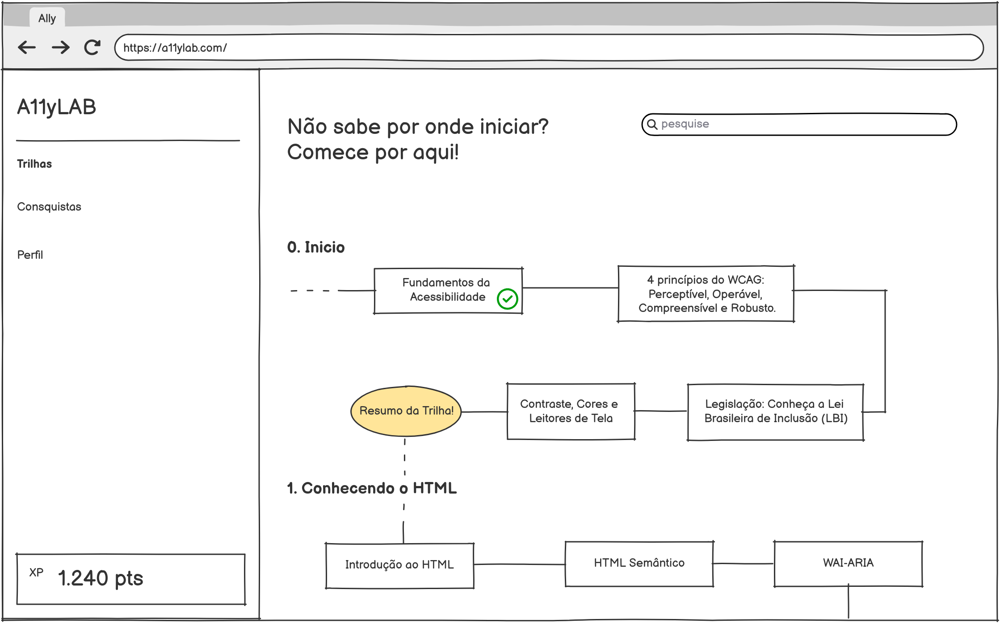
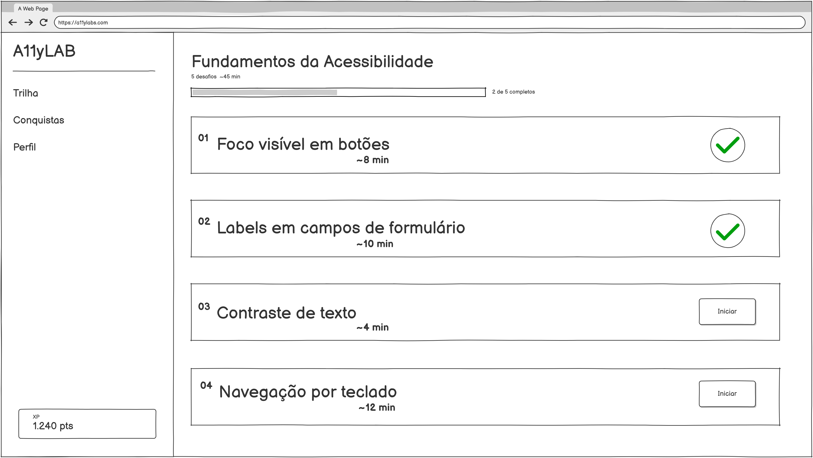
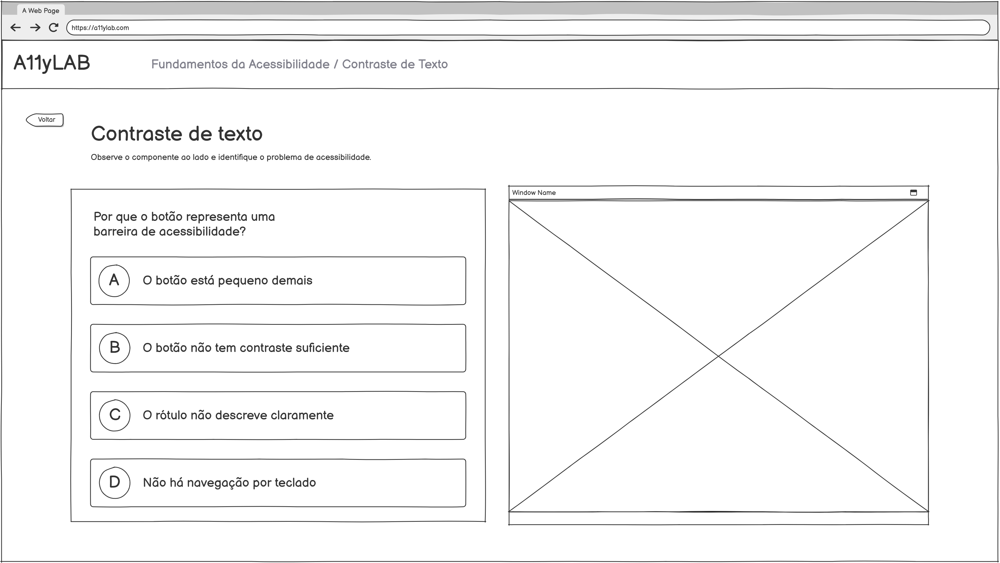
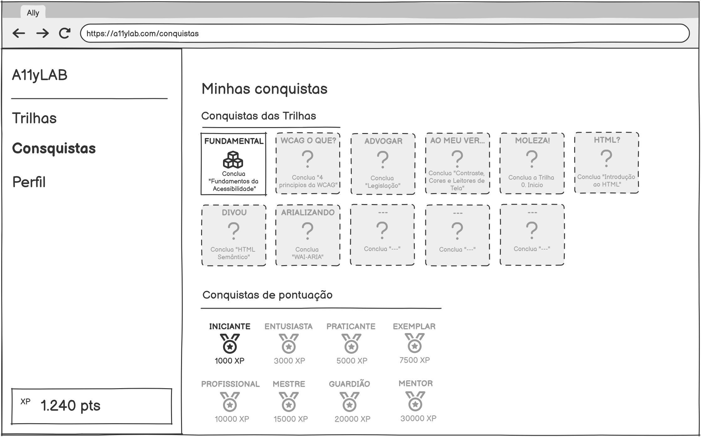
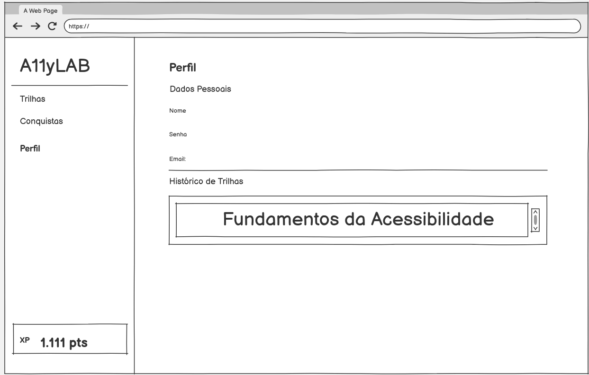

# 4 - Prototipar
“ Este cartão tem como objetivo principal transformar ideias abstratas e conceitos gerados na fase de ideação em representações tangíveis, físicas ou digitais, de forma rápida, barata e iterativa. Essa etapa pretende validar hipóteses com casos de uso, identificar falhas precocemente e reduzir incertezas ou custos antes da implementação final.”

## Planilhas:
- [Insights](assets/insights.xlsx)
- [Tasks](assets/tasks.xlsx)

## Estórias que descrevem jornadas dos usuários
- Como dev frontend, quero entrar na aplicação, encontrar um desafio de um tópico que tenho dificuldade e tentar resolver o desafio.
- Como estudante, depois de resolver um desafio, quero ter uma explicação simples do conceito exercitado.
- Quero entrar na plataforma e retirar minhas dúvidas lendo uma das aulas rápidas ou fazendo um desafio.
- Como um desenvolvedor em treinamento, quero depurar interfaces com falhas de acessibilidade de forma interativa para que eu possa validar tecnicamente como a implementação de padrões inclusivos restaura a funcionalidade da experiência do usuário.
- Como um estudante em busca de prática, quero manipular componentes em um laboratório interativo de simulação em tempo real para transformar o aprendizado de acessibilidade em um processo de reparo técnico imediato sobre interfaces propositalmente instáveis.
- Como um Designer preciso entender o que é necessário para uma aplicação web ter acessibilidade, podendo assegurar usabilidade para qualquer usuário
- Como um curioso/entusiasta, preciso entender como funciona a implementação e o desenvolvimento para tornar um app acessivel

## Telas do Mockup
### Roadmap das Trilhas (Home)

### Trilha (dentro de uma trilha do Roadmap)

### Desafio (dentro da trilha)

### Conquistas 

### Perfil
